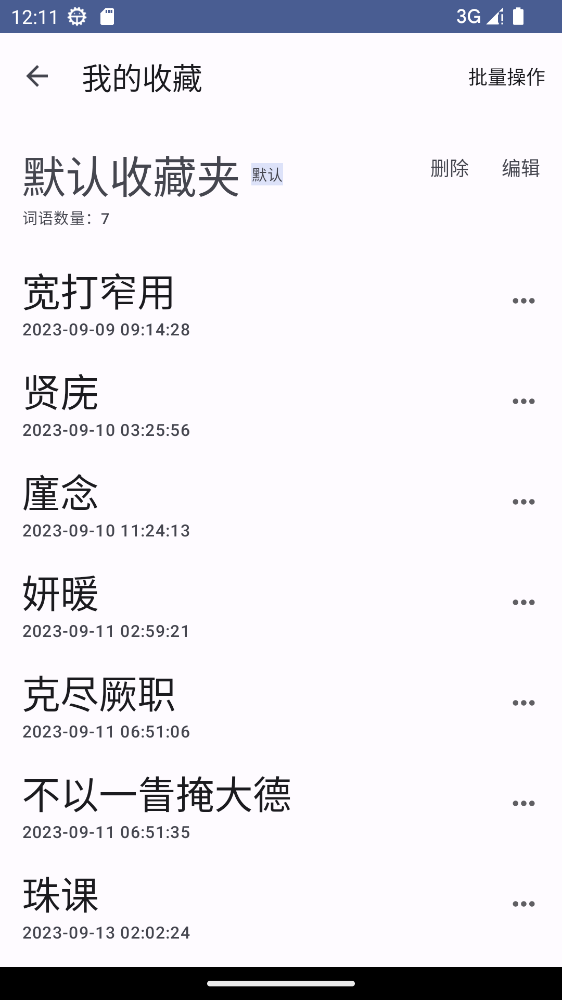

# ***小白词***（XiaoBaiCi）  

***小白词*** 是一个为学习和实践而开发的中文词典类本地应用  

词典数据来源于一个[开源的词典项目](https://github.com/mapull/chinese-dictionary "汉语拼音辞典")，小白词只用到了其中的 **word.json** 部分数据  

简单地使用了 `DataStore`、 `Navigation`、`Room`、 `Paging`、 `Hilt`、 `Lifecycle` 等Jetpack库，以及 `CommonMark`、 `RxJava 3`、 `AutoDispose`等其他开源库  

# 主要功能和截图

- 主页：随机浏览词条，支持上下和左右滑动

      

- 搜索

    
    

- 收藏：搜藏词条，收藏夹管理

     
     

- 浏览历史

     

- 其他：Material You(M3) 基于用户壁纸颜色的动态配色主题功能